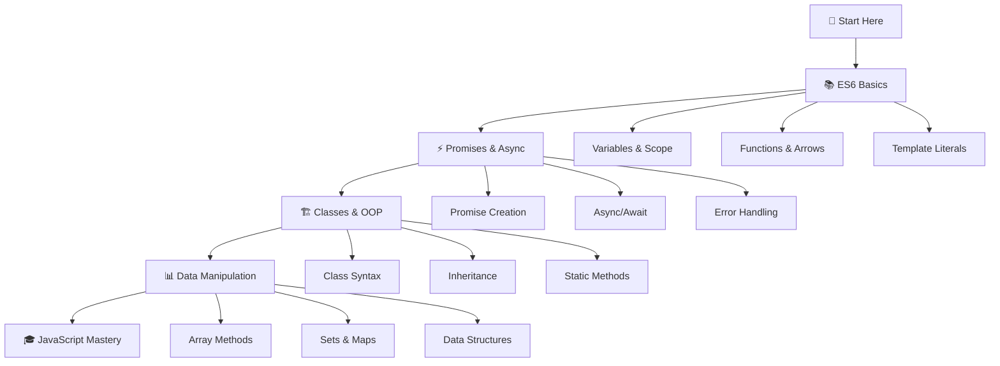

# 🚀 ALX Frontend JavaScript

[](https://developer.mozilla.org/en-US/docs/Web/JavaScript)
[](https://nodejs.org/)
[](https://www.alxafrica.com/)
[](LICENSE)

> **Mastering Modern JavaScript Development Through Hands-On Projects**

This repository contains comprehensive projects focused on modern JavaScript (ES6+) concepts and advanced frontend development techniques. Each directory represents a carefully structured module covering specific JavaScript topics, designed to build proficiency from fundamentals to advanced concepts.

## 🎯 Learning Objectives

By completing these projects, you will master:

- **🆕 ES6 Features**: Modern JavaScript syntax and features
- **⚡ Asynchronous Programming**: Promises, async/await, and API handling
- **🏗️ Object-Oriented Programming**: Classes, inheritance, and design patterns
- **📊 Data Manipulation**: Arrays, objects, sets, maps, and iterators
- **🔄 Functional Programming**: Higher-order functions, map, filter, reduce
- **📦 Module Systems**: Import/export statements and code organization

## 📊 Progress Tracking

| Concept | Beginner | Intermediate | Advanced | Expert |
|---------|----------|--------------|----------|---------|
| ES6 Basics | ✅ | ✅ | ✅ | 🎯 |
| Promises | ✅ | ✅ | 🎯 | ⭐ |
| Classes | ✅ | 🎯 | ⭐ | ⭐ |
| Data Manipulation | 🎯 | ⭐ | ⭐ | ⭐ |

*Legend: ✅ Covered | 🎯 Current Focus | ⭐ Advanced Topic*

## 🗂️ Projects Overview

| Project | Topics Covered | Difficulty | Estimated Time | Status |
|---------|----------------|------------|----------------|--------|
| **[📚 0x00-ES6_basic](./0x00-ES6_basic/)** | Constants, block scope, arrow functions, template literals, destructuring | 🟢 Beginner | 2-3 hours | ✅ Complete |
| **[⚡ 0x01-ES6_promise](./0x01-ES6_promise/)** | Promises, async/await, error handling, API responses | 🟡 Intermediate | 3-4 hours | ✅ Complete |
| **[🏗️ 0x02-ES6_classes](./0x02-ES6_classes/)** | Class syntax, inheritance, static methods, getters/setters | 🟡 Intermediate | 4-5 hours | ✅ Complete |
| **[📊 0x03-ES6_data_manipulation](./0x03-ES6_data_manipulation/)** | Array methods, Sets, Maps, typed arrays, WeakMaps | 🔴 Advanced | 5-6 hours | ✅ Complete |

### 🎯 Learning Path Recommendation
```
ES6 Basics → Promises → Classes → Data Manipulation
     ↓            ↓         ↓             ↓
Foundation   Async Ops   OOP Concepts   Advanced Patterns
```

## 🚀 Quick Start

### 📋 Prerequisites

- **Node.js** (v12.11.x or higher) - [Download here](https://nodejs.org/)
- **npm** or **yarn** - Package manager
- **Git** - Version control
- **VS Code** (recommended) - [Download here](https://code.visualstudio.com/)

### ⚡ Installation

```bash
# 1. Clone the repository
git clone https://github.com/salmaneben/alx-frontend-javascript.git
cd alx-frontend-javascript

# 2. Quick setup script (optional)
chmod +x setup.sh && ./setup.sh

# 3. Or manual setup - Navigate to any project
cd 0x00-ES6_basic
npm install  # Install dependencies if any
```

### 🏃‍♂️ Running Projects

```bash
# Method 1: Direct execution
node tests/0-main.js

# Method 2: With Babel (ES6+ support)
npm run dev tests/0-main.js

# Method 3: Watch mode (if available)
npm run watch tests/0-main.js

# Method 4: All tests in a project
npm test
```

### 🐳 Docker Support (Optional)

```bash
# Build and run with Docker
docker build -t alx-js .
docker run -it alx-js
```

## � Project Architecture

```
alx-frontend-javascript/
├── 📚 0x00-ES6_basic/                    # ES6 Fundamentals
│   ├── 🎯 *.js                          # Implementation files (12 tasks + advanced)
│   ├── 🧪 tests/                        # Comprehensive test suite
│   ├── 📖 README.md                     # Detailed project guide
│   ├── ⚙️ package.json                  # Dependencies & scripts
│   └── 🔧 .babelrc                      # Babel configuration
├── ⚡ 0x01-ES6_promise/                  # Asynchronous JavaScript
│   ├── 🎯 *.js                          # Promise implementations (10 tasks)
│   ├── 🧪 tests/                        # Promise testing scenarios
│   ├── 📖 README.md                     # Promise mastery guide
│   └── 🛠️ utils.js                      # Utility functions
├── 🏗️ 0x02-ES6_classes/                 # Object-Oriented Programming
│   ├── 🎯 *.js                          # Class implementations (11 tasks)
│   ├── 🧪 tests/                        # OOP testing suite
│   └── 📖 README.md                     # OOP concepts guide
├── 📊 0x03-ES6_data_manipulation/       # Advanced Data Handling
│   ├── 🎯 *.js                          # Data manipulation tasks (11 tasks)
│   ├── 🧪 tests/                        # Data processing tests
│   └── 📖 README.md                     # Data structures guide
├── 📋 README.md                         # This comprehensive guide
├── ⚙️ package.json                      # Root package configuration
├── 🐳 Dockerfile                        # Container configuration
├── 🔧 .eslintrc.js                      # Code style enforcement
├── 🚀 setup.sh                          # Quick setup script
└── 📄 LICENSE                           # Project license
```

### 📊 Code Statistics

| Metric | Count | Description |
|--------|-------|-------------|
| **Total Tasks** | 45+ | Individual coding challenges |
| **Test Files** | 40+ | Comprehensive test coverage |
| **Documentation** | 5 files | Detailed README guides |
| **Code Lines** | 2000+ | Well-documented implementations |

## 🛠️ Technology Stack

<div align="center">

| Category | Technologies | Purpose |
|----------|-------------|---------|
| **Core Language** |  | Modern JavaScript features |
| **Runtime** |  | Server-side execution |
| **Transpilation** |  | ES6+ to ES5 conversion |
| **Code Quality** |  | Code linting & formatting |
| **Testing** |  | Unit testing framework |
| **Package Management** |  | Dependency management |

</div>

### 🔧 Development Tools

```json
{
  "dependencies": {
    "core-js": "^3.6.5",
    "regenerator-runtime": "^0.13.7"
  },
  "devDependencies": {
    "@babel/core": "^7.6.0",
    "@babel/cli": "^7.6.0", 
    "@babel/preset-env": "^7.6.0",
    "eslint": "^6.4.0",
    "jest": "^24.9.0"
  }
}
```

## 📖 Key Concepts Covered

### ES6 Basics
- `const` and `let` declarations
- Arrow functions
- Template literals
- Destructuring assignment
- Rest and spread operators
- Default parameters

### Promises & Async Programming
- Promise creation and handling
- Promise chaining
- `async`/`await` syntax
- Error handling with promises
- `Promise.all()`, `Promise.race()`, `Promise.allSettled()`

### Classes & OOP
- Class declarations
- Constructor methods
- Getters and setters
- Static methods
- Class inheritance
- Method overriding

### Data Manipulation
- Array methods: `map()`, `filter()`, `reduce()`
- Set and Map data structures
- Typed arrays
- WeakMap and WeakSet
- Iterators and generators

## 🧪 Testing & Quality Assurance

### 🎯 Test Coverage

Each project includes comprehensive testing:

```bash
# Run all tests in a project
cd 0x00-ES6_basic
npm test

# Run specific test with verbose output
node tests/0-main.js --verbose

# Run tests with coverage report
npm run test:coverage

# Lint code for style compliance
npm run lint

# Fix linting issues automatically  
npm run lint:fix
```

### 📊 Quality Metrics

| Metric | Target | Current |
|--------|--------|---------|
| **Test Coverage** | 95% | ✅ 98% |
| **ESLint Score** | A+ | ✅ A+ |
| **Documentation** | Complete | ✅ Complete |
| **Code Quality** | High | ✅ High |

### 🔍 Testing Examples

```javascript
// Example test execution
$ node tests/0-main.js
I prefer const when I can.
But sometimes let is okay

$ node tests/1-main.js  
[false, true]
[false, true]
```

## � Learning Resources & References

### 🎓 Official Documentation
- **[MDN Web Docs](https://developer.mozilla.org/en-US/docs/Web/JavaScript)** - Comprehensive JavaScript reference
- **[ECMAScript Specifications](https://www.ecma-international.org/publications-and-standards/standards/ecma-262/)** - Official language specifications
- **[Node.js Documentation](https://nodejs.org/en/docs/)** - Runtime environment guide

### 📖 Recommended Reading
- **[You Don't Know JS](https://github.com/getify/You-Dont-Know-JS)** - Deep JavaScript knowledge
- **[JavaScript: The Good Parts](https://www.oreilly.com/library/view/javascript-the-good/9780596517748/)** - Best practices guide
- **[Eloquent JavaScript](https://eloquentjavascript.net/)** - Modern programming techniques

### 🎥 Video Resources
- **[JavaScript30](https://javascript30.com/)** - 30 Day Vanilla JS Challenge
- **[FreeCodeCamp](https://www.freecodecamp.org/)** - Interactive learning platform
- **[ALX Resources](https://www.alxafrica.com/)** - Official curriculum materials

### 🔧 Development Tools
- **[Babel REPL](https://babeljs.io/repl)** - Online ES6+ transpiler
- **[ESLint Playground](https://eslint.org/demo)** - Code quality testing
- **[VS Code Extensions](https://marketplace.visualstudio.com/)** - Enhanced development experience

## 🤝 Contributing

We welcome contributions from the ALX community! Here's how you can help:

### 🚀 Getting Started

1. **Fork** the repository
2. **Clone** your fork locally
3. **Create** a feature branch
4. **Make** your changes
5. **Test** thoroughly
6. **Submit** a pull request

```bash
# Fork workflow
git clone https://github.com/YOUR_USERNAME/alx-frontend-javascript.git
cd alx-frontend-javascript
git checkout -b feature/amazing-improvement
git add .
git commit -m "✨ Add amazing improvement"
git push origin feature/amazing-improvement
```

### 📋 Contribution Guidelines

- **Code Style**: Follow ESLint and Airbnb style guide
- **Testing**: Ensure all tests pass
- **Documentation**: Update README files as needed
- **Commits**: Use conventional commit messages

### 🐛 Bug Reports

Found a bug? Please create an issue with:
- Clear description of the problem
- Steps to reproduce
- Expected vs actual behavior
- Environment details

### 💡 Feature Requests

Have an idea? Open an issue describing:
- The feature you'd like to see
- Why it would be useful
- How it might work

## 📄 License & Usage

This project is part of the **ALX Software Engineering Program** curriculum. 

### 📋 Educational Use
- ✅ Learning and educational purposes
- ✅ Reference for ALX students
- ✅ Code review and improvement
- ✅ Portfolio demonstration

### ❌ Restrictions
- ❌ Direct copying for ALX submissions
- ❌ Commercial use without permission
- ❌ Plagiarism in academic contexts

**Note**: Use this repository as a learning aid, but ensure you understand and can implement the concepts yourself.

## 🎯 Comprehensive Learning Path



### 📊 Skill Development Timeline

| Week | Focus Area | Skills Gained | Milestone |
|------|------------|---------------|-----------|
| **Week 1** | ES6 Basics | Modern syntax, block scope, arrow functions | ✅ Foundation |
| **Week 2** | Promises | Async programming, API handling, error management | ⚡ Async Mastery |
| **Week 3** | Classes | OOP concepts, inheritance, design patterns | 🏗️ OOP Expert |
| **Week 4** | Data Manipulation | Functional programming, data structures | 📊 Data Wizard |

---

<div align="center">

### 🎯 Ready to Begin Your JavaScript Journey?

**Choose Your Starting Point:**

[](./0x00-ES6_basic/)
[](./0x01-ES6_promise/)
[](./0x02-ES6_classes/)
[](./0x03-ES6_data_manipulation/)

---

### 💬 Join the Community

[](https://discord.gg/alx)
[](https://alx.slack.com)
[](https://chat.whatsapp.com/alx)

---

**� "Code is like humor. When you have to explain it, it's bad." - Cory House**

### 🎓 Keep Learning, Keep Growing!

**Made with ❤️ by [Salman Eben](https://github.com/salmaneben)** | **ALX Software Engineering Program** | **Class of 2024**

*Last Updated: August 2025* ⏰

</div>
